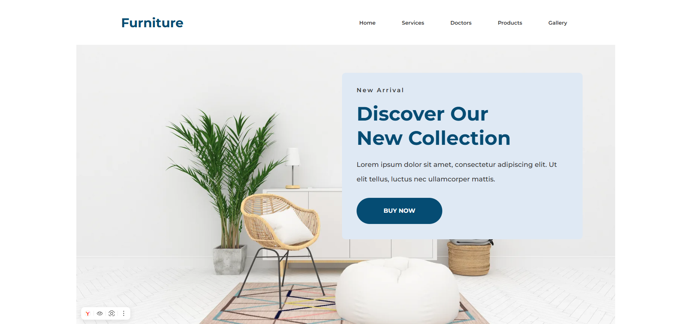

# :chair: Furniture-Project - лендинг сайта по продаже мебели



## :clipboard: Описание

**Furniture Project** - одностраничный лендинг сайта для демонстрации и продажи мебели. Сайт включает несколько тематических секций: коллекции мебели, преимущества, процесс покупки и форму оформления подписки на новости.

## :hammer_and_wrench: Стек технологий

**Frontend**:

- HTML
- JavaScript
- Sass/SCSS
- Bootstrap 5

**Прочее**:

- Webpack - сборка проекта
- Github Pages - хостинг и деплой

## :white_check_mark: Основные особенности

- **Адаптивный дизайн** под разные устройства
- **Модульная структура** SASS с использованием переменных и `mixins`
- **Классическая** архитектура
- **Семантическая верстка**
- **Intersection Observer** для анимации появления элементов
- Использование `next-gen` **формата сжатия** изображения - `WebP`

## :rocket: Установка и запуск

1. Клонирование репозитория:

   ```bash
   git clone https://github.com/Niko142/Furniture-project.git
   ```

2. Установка зависимостей:

   ```bash
   npm install
   ```

3. Запуск проекта:

   ```bash
   npm run dev # запуск локальной dev-сборки
   npm run build # сборка production-версии
   npm run preview # предпросмотр production-сборки
   ```

Результаты сборки будут представлены в папке `/dist`

## :file_folder: Структура проекта

```text
Furniture-project
├── public
│   ├── favicon.png
│   └── image.png
├── src
│   ├── assets
│   │   ├── fonts
│   │   ├── images
│   │   └── styles
│   ├── components
│   │   ├── advantages.js
│   │   └── form-handler.js
│   ├── constants
│   │   └── delay.js
│   ├── data
│   │   └── advantages-data.js
│   ├── index.html
│   ├── index.js
│   ├── services
│   │   └── intersection-observer.js
│   └── utils
│       └── validation.js
```

## :bulb: Ссылки

:computer: Демо: [Ссылка](https://niko142.github.io/Furniture-project/)
:art: Макет в Figma: [Ссылка на макет](<https://www.figma.com/design/Fy43OVGQPWHunavHt3ekBL/Furniture-Website-(Community)?node-id=16-65&t=8ugTAhargkVr74nZ-1>)
